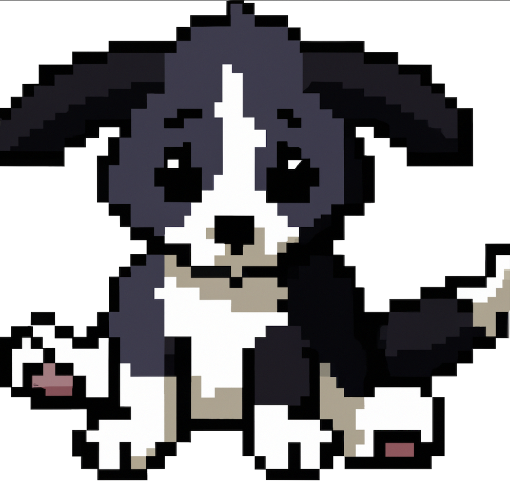
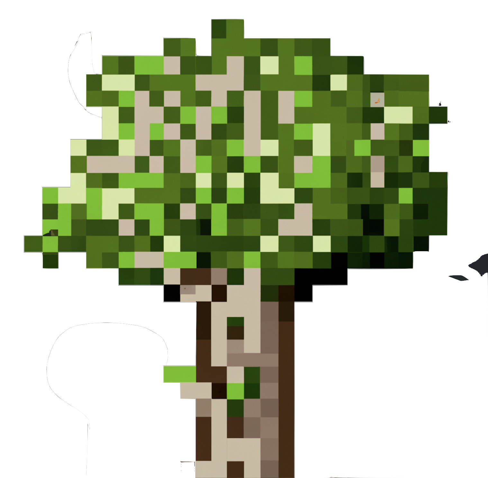
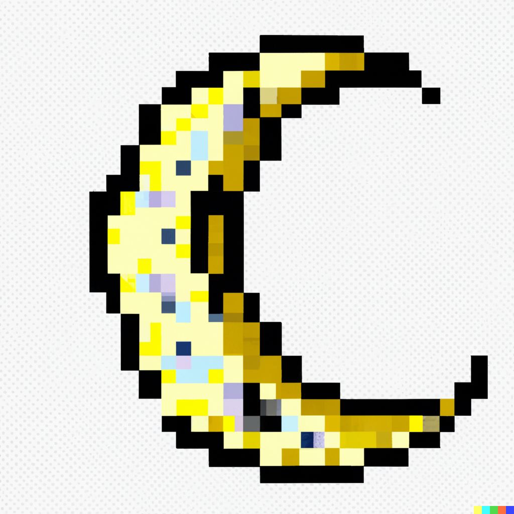

        
                  
        
        
        
        
        
        
         
        
        
        
        
        
        
        
        
        
        
        
        
        
        
        
        
        
        
        
        
          
            
         
            
              
        
        
