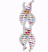

 
Commits

 
  Visitor count 
  
  
  
  
  

  

  
  <table style="border: 1px none">
  <tr style="border-style: none">
    hi
  </tr>
  <tr style="border-style: none">
    <td style="border-style: none">400</td>
    <td style="border-style: none">500</td>
    <td style="border-style: none">600</td>
  </tr>
</table>

