<a href="https://mollybeach.app/?from=githubreadme" target="_blank" rel="noopener">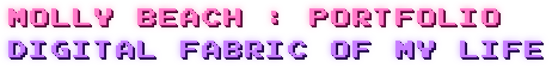</a>

  <a href="https://mollybeach.app/?from=githubreadme" target="_blank" rel="noopener">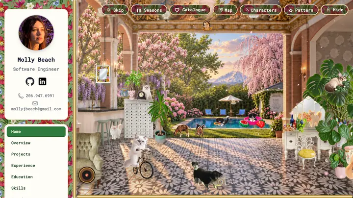</a>
  <a href="https://mollybeach.app/?from=githubreadme" target="_blank" rel="noopener">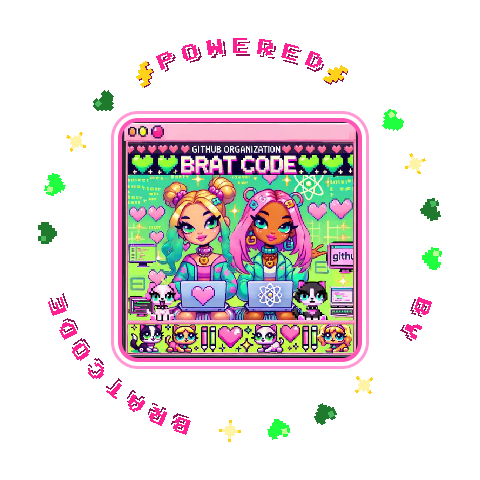</a>
  

  

  <a href="https://mollybeach.app/closet" target="_blank" rel="noopener">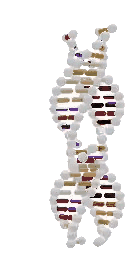</a>

 

  <a href="https://mollybeach.app/closet" target="_blank" rel="noopener">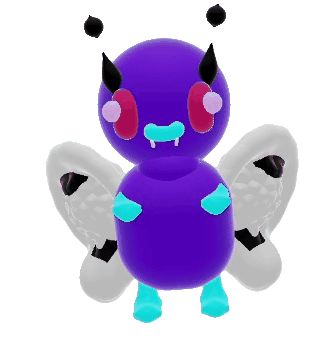</a>
  
  
  <a href="https://mollybeach.app/?from=githubreadme#caves" target="_blank" rel="noopener">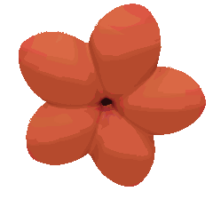</a>
  <!-- Next line -->
  <a href="https://mollybeach.app/closet" target="_blank" rel="noopener">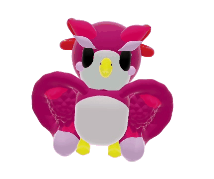</a>
  
  <a href="https://mollybeach.app/closet" target="_blank" rel="noopener">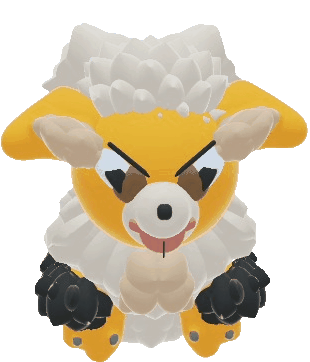</a>
  

 

  
  
  
    
   
  
  
  
  

  <a href="https://mollybeach.app/?from=githubreadme#caves" target="_blank" rel="noopener">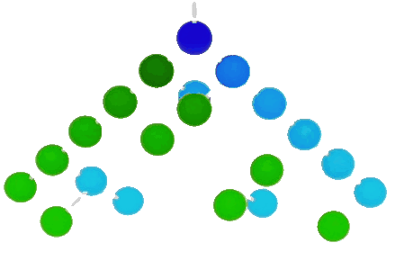</a>

  
  <a href="https://mollybeach.app/?from=githubreadme#caves" target="_blank" rel="noopener">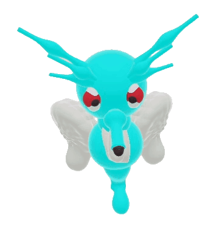</a>
  
  <a href="https://mollybeach.app/?from=githubreadme#caves" target="_blank" rel="noopener">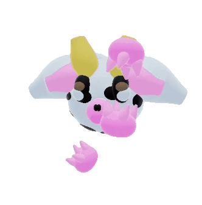</a>
  <a href="https://mollybeach.app/closet" target="_blank" rel="noopener">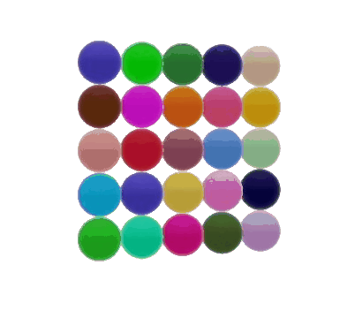</a>
  
  <a href="https://mollybeach.app/?from=githubreadme#caves" target="_blank" rel="noopener">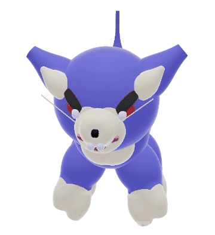</a>
  <!-- Next line -->
  <a href="https://mollybeach.app/?from=githubreadme#caves" target="_blank" rel="noopener">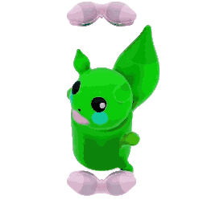</a>
    
  <a href="https://mollybeach.app/?from=githubreadme#caves" target="_blank" rel="noopener">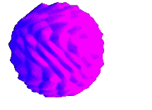</a>
  <a href="https://mollybeach.app/?from=githubreadme#caves" target="_blank" rel="noopener">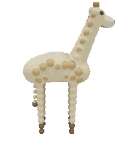</a>

 

<b>✨ More shaders</b>

 

  <a href="https://mollybeach.app/?from=githubreadme#caves" target="_blank" rel="noopener">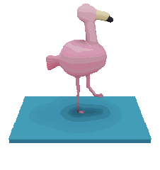</a>
  
  <a href="https://mollybeach.app/?from=githubreadme#caves" target="_blank" rel="noopener">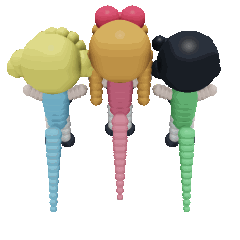</a>
  <a href="https://mollybeach.app/?from=githubreadme#caves" target="_blank" rel="noopener">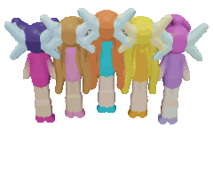</a>
  
  <a href="https://mollybeach.app/?from=githubreadme#caves" target="_blank" rel="noopener">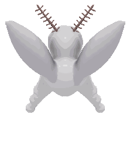</a>
  
  
  
    <a href="https://mollybeach.app/closet" target="_blank" rel="noopener">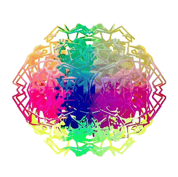</a>
  
  <a href="https://mollybeach.app/?from=githubreadme#caves" target="_blank" rel="noopener">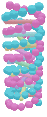</a>
  <a href="https://mollybeach.app/?from=githubreadme#caves" target="_blank" rel="noopener">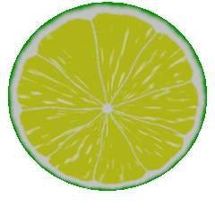</a>
  <a href="https://mollybeach.app/?from=githubreadme#caves" target="_blank" rel="noopener">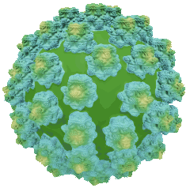</a>
  
  <a href="https://mollybeach.app/?from=githubreadme#caves" target="_blank" rel="noopener">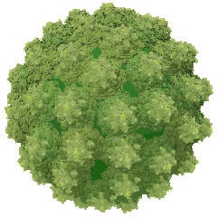</a>

<b>✨ More Palais </b>

 

## ✨ The Palais

### **Live at [mollybeach.app](https://mollybeach.app)**

### A room that lives through the year
- **Four seasons on an 80-second year.** Spring, summer, autumn and winter photographs crossfade on a CSS animation timeline. **Skip** jumps ahead by driving the animations directly through the Web Animations API (`currentTime`, `playbackRate`), and **Pause** freezes the whole year, every room at once.
- **Weather that follows the photographs.** Snow in winter, falling leaves in autumn and cottonwood fluff in summer come from a canvas particle system. It reads how far each season's photo has faded in, so the weather thickens as a season arrives and thins as it leaves.
- **Visitors.** Hummingbirds and dragonflies fly through now and then on a small requestAnimationFrame flight engine.
- **Moving parts.** Honeysuckle's tricycle wheels spin, and her sewing machine's needle goes up and down while the fabric feeds through. Each sticker is cut into layers and animated separately.
- **Phone layout.** Phones get their own portrait photographs and layout rather than a squashed desktop.

### ~100 stickers you can rearrange
- **Drag anything anywhere.** Pick-up hit-testing checks the image's own transparency, so you grab the cat and not the empty corner of its picture. The item you're holding comes to the front, and a corner handle resizes it.
- **Positions that survive resizing.** Moves are stored as fractions of the stage (container query units, `cqw`/`cqh`), so an arrangement holds at any window size. The scene is mapped onto whichever background photo is showing: taller, wider or phone.
- **A dress-up-game catalogue.** Every sticker sits on a shelf (Furniture, House plants, Cats, Dogs, Goats, Artwork, Hanging lights, Teacups, Trinkets…). Heart them in or out of the room, one at a time or a whole shelf at once.
- **A layout for each season.** Each season has its own default arrangement: the autumn table only in autumn, the dogs in the pool in spring and summer. The room glides into the new layout when the season turns.

### Area M: the world map
A cute, video-game-style level select. Honeysuckle hops along a dotted path between stops on an island inside a shimmering rainbow wall. Each stop is a region blended from real trips, and many of them are rooms you can walk into:

| Room | |
|---|---|
| 🏛 The Palais | home, the terrace |
| 🍰 The Kitchen | the whole kitchen behind the terrace's marble bar |
| 🛁 The Bathroom | the blush bathroom through the terrace's right arch |
| 🌿 The Glasshouse | an iron-and-glass garden conservatory |
| 🏠 The Lakehouse | a glass lake house with a red bridge and a boathouse, in four seasons |
| 👗 The Wardrobe Wing | a pink closet with lemon wallpaper and a waterfall, in four seasons |
| ♨️ The Steaming Lagoon | a blue lagoon under the northern lights, in four seasons |
| 🌲 The Rainwood | a fern-covered conservatory in a rainforest |
| 🎵 The Amphitheatre | a festival stage on a canyon rim at sunset |
| 🕌 The City of Domes | a marble bath above domes, trams and gondolas |
| 💜 The Jacaranda Quarter | a balcony over a purple jacaranda street at dusk |
| 🐢 The Glass Reef | a seashell pavilion half under the sea |

Rooms keep their place in the address (`mollybeach.app/#lagoon`), so a refresh or a shared link opens the same room. All rooms turn through the seasons together.

### Saved Looks
Signed in, I can save the room as a named look, file it under a season, make it that season's default, and keep older looks to go back to. Everyone can read looks, but only editors can change them, and row-level security enforces that in the database, not in the UI.

---

## 📄 The résumé side

- **Experience:** an expandable timeline of roles, with project details
- **Projects:** project cards with live preview screenshots (Microlink)
- **Skills, Education, Awards, Certifications**
- **Résumé:** a printable résumé page
- **Link previews:** social media previews and meta tags (react-helmet-async)

## 🛠 Tech stack

- **React 18** + **TypeScript** (Create React App), **react-router**
- **Tailwind CSS** for the résumé pages; hand-written, scoped CSS for the Palais (container queries, CSS animations, custom properties)
- **Web Animations API**, **Canvas 2D**, **requestAnimationFrame**, **ResizeObserver**
- **Supabase** (Postgres, row-level security, auth, SQL functions), loaded lazily so the room never waits on it
- **Image pipeline:** background removal (rembg), OpenCV feature matching (SIFT and homography) to align the season photographs, WebP export
- **Hosting:** Vercel

